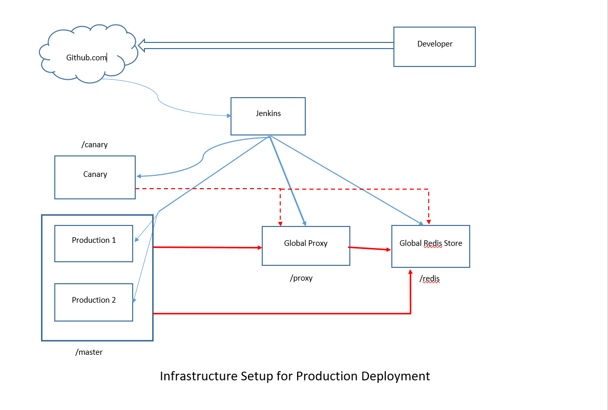

# DevOps-M3

# Milestone 3 - DevOps

## Infrastructure Setup

 

**Legend**

_Blue Connections_ : Deployment Paths
 _Red Connections_ : Production Communication Paths

## Infrastructure Components

* **Build Server**

  When a developer commits the code to the repository, build server fetches the recent commit and checks the build status of the repository.

  We have used Jenkins as the build server and with the Github Webhooks, the recent commit of the data is fetched and build activities are performed on them.

  Based on the branch on which the push is made, Jenkins performs respective activities and deploys on respective hosts.

  Following are four main build activities based on branches that are deployed:
  * Production - `/master`, The application hosted
  * Proxy Server - `/proxy`, The proxy server settings and port forwarding logic
  * Redis Store - `/redis`, The global redis store available to production and proxy servers.
  * Canary - `/canary`, The application with any canary/beta tests.

* **Proxy Server**

  Hosts the Nginx webserver and acts as a proxy server. Proxy server connects to the Production servers. Internally, Proxy Server will distribute requests to the available production and canary servers based on their availability.

  It refers to the Redis Store to check the currently used servers and available servers. In case of auto-scaling the redis's server queues are managed to server the newly allocated servers.

* **Redis Store**

  A global Redis Store is hosted which helps to control the features, active servers to be used by proxy. The Redis will store following:

  * _Available Servers_
  * _Currently Serving Servers_
  * _Canary Servers_

* **Production Servers**

  It hosts the application logic. It hosts ExpressJS server to serve the application logic. Any global variables are stored in the Redis Store so that all production servers can access the common data.

* **Canary Server**

  Hosts the application logic to be tested viz. new feature or beta version of the application logic. The user can expected different behavior of application when the request hits the Canary Server.
  
