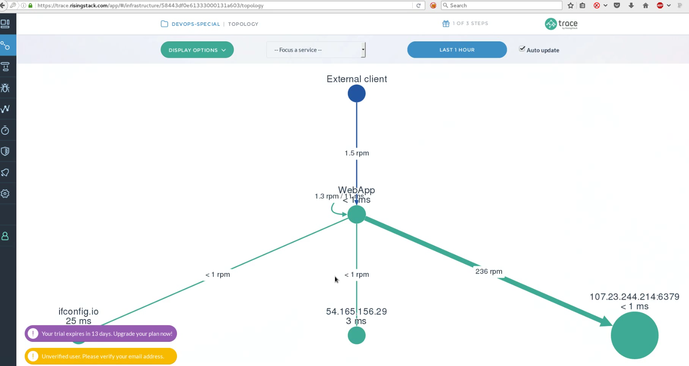
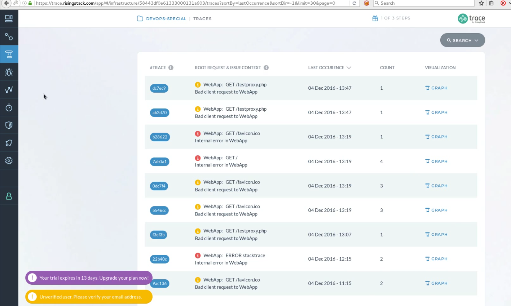
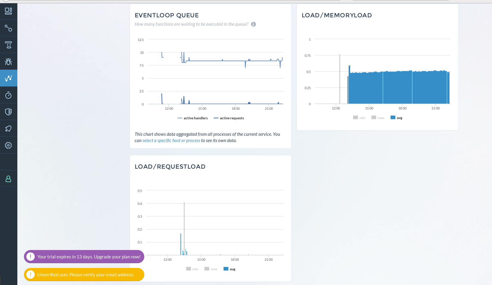
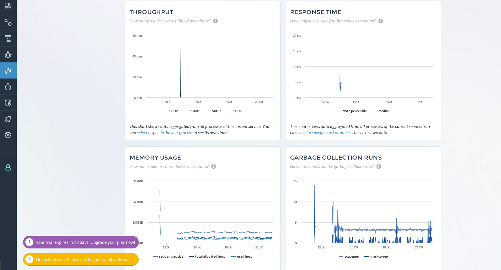

# CSC 791 - DevOps Project - Special Milestone

## Team

* Aniket Patel (apatel10)
* Subodh Dharmadhikari (ssdharma)
* Matrika Rohatgi (mrohatgi)

### Special Milestone

#### Architecture

The system consists of following components:
* Build Server - Jenkins
* Redis Server
* Proxy Server
* Application Server

The deployment of each server is controlled using git branches, Jenkins and Ansible playbooks. The repository contains branches namely `/master`, `/redis` and `/proxy` to deploy any configurations or application logic to Application Server, Redis Server and Proxy Server respectively. The build and deployment is performed at each push to respective branch.

This strategy helps in maintaining a continuous build and deployment pipeline.

#### Features

###### _Monitoring Services_

The system has two monitoring services deployed. Both work on Application servers.
1. Request Monitor - This monitor calculates the number of request received at each application server individually. The count is updated continuously to Redis server in a hash table with the name same as that of the IP address of the app server.
2. Memory Monitor - This monitor uses `os-monitor` npm package to check the memory usage of the system periodically. This service also updates the redis server with memory_load hash table.

###### _Auto Scaling_

The system has an autoscaler which runs on the `/redis` branch. The auto-scaling is enabled based on the metrics received from monitoring services. The autoscaler reads the metrics saved by application server and makes a decision on upscaling or downscaling the architecture components. Currently the system supports scaling of Application Server only. For upscaling it will instantiate a new AWS server to load balancing activities.

###### _Test URL Fuzzer_

The `urlfuzzer.js` has the capability to generate a .json file which contains the parameters for loadtest apis. The `urlfuzzer.js` when executed will generate new file i.e. `generatedTests.json`, which will contain urls for load testing.

The main aim of the chaos monkey is to create HTTP requests and send in bulk, it will open concurrent connections, send HTTP requests for existing urls and with different requests per second. It will also create requests with different header options.

Effects of chaos monkey can be seen mainly on Proxy Server and Application Server. Since large number of requests are received the proxy server, because of limited memory and CPU resources in unable to handle them. The chaos monkey doesn't waits for the requests response, as a result many connection at proxy are left opened and hence gets crashed as a result of socket exhaustion. This test the infrastructure resilience to keep the proxy from failing.

Another effect that chaos monkey causes is the request load on application servers. The number of request that are received by the application server may vary highly. Thus this tests the auto-scaling feature where the application servers must dynamically upscale and downscale based on number of requests the chaos monkey is generating.

#### Trace Profiler
Trace is a graphical viewer for execution logs for tracing log information in the code. It helps in debugging the application as well as profile it's performance. Trace helps find and fix issues using profilers, distributed tracing, error detection as well as custom metrics.

Here, we can visualize our whole infrastructure. This helps in getting health of all the services and even hints if they are getting slower.

Trace errors and their origin.

Or even check metrics.

We use these metrics to take scaling decisions.

**Link:** 
[Trace](https://trace.risingstack.com/)